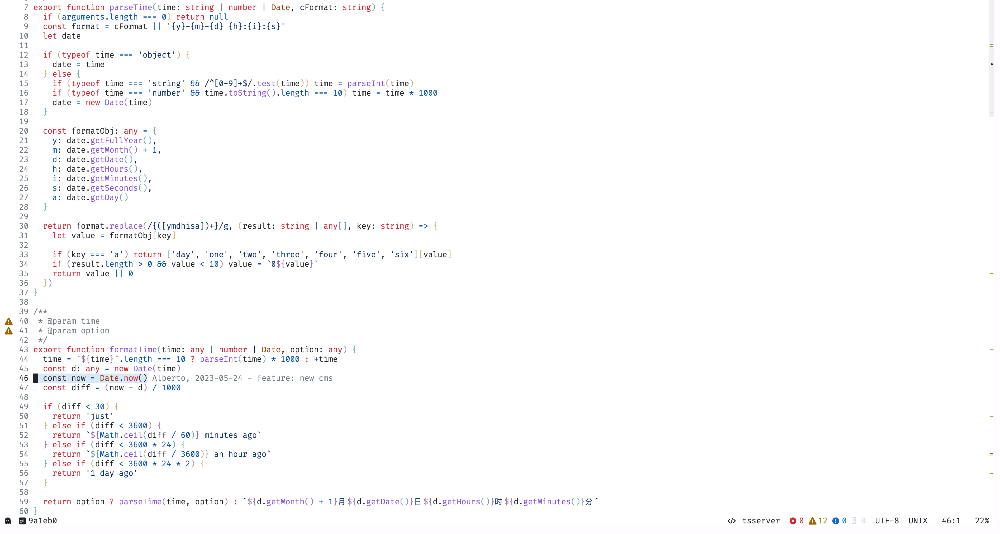

# xotovim

```bash
.                                                .
                     ...   ......,,**//*          
               . ...,,,,***********,,,/(#         
             ..      ,,,,********//////(((        
         . ..   ...,,,,,,********////////((#.     
       ...,  ,,,,,,,,,,****,.....,,,,**/(((###    
      .***,,,,,,,,,,,****,/###(#%&&&&%((///###%#  
     .,/**,,,,***********((((         ,&&(((((%%% 
    .(//////****///**///((%             .%&(/.(%%#
    ,,/////////////////(((               *%#/(##%&
 ...,(((////////////////(#               ,#//##&&&
 (.,,,,#(((///////////((//%.            *(,*(#%%%&
 /*,,****%((((((((((((##(///#&(.   .*///,,/(#%%%%&
  ,***///(((((((((((((%####///****,,,,,/(###%%%%& 
   (/((((##%#(#########%%%#(#######%%%%/,%%%%%%%  
    (######%&%#%##%%%%%#%%%%%####%%%&&&&&&&&%%#   
     ######%&&%%%%%%%%%%%#%%%%%%%%%%%&&&&(%%#     
           @&&&&&&&&%%%%%&&%%%%%%%%%%%%%%%(       
              &&%%%%%%%%%&%%%%%%%%%#%%#*          
                   #%%%%%%%%%#####*               
```


### A non-minimal Neovim config built to work most efficiently with any development

## Features 💠

- recommended default theme: github-light
- highly performant even with a lot of plugins
- lazy loaded
- extendable lsp configuration
- support for tailwindcss with highlighted colors
- support for tabnine and copilot
- json autocompletion for most popular frontend config
- npm packages autocompletion
- internal jest testing
- treesitter-based folding
- git management with lazygit gitdeta gitsigns diffview

And of course usage of telescope, barbar, cm

## Screenshots 📸

Dashboard



## Requirements ⚡️

```bash
# install nvim 8 or higher
bash <(curl -s https://raw.githubusercontent.com/xotovim/xotovim/development/.install/nvim.sh)
```


## Installation ⚡️

```bash
# clone on your nvim folder
git clone https://github.com/xotovim/xotovim.git ~/.config/nvim
```
 
## Configuration 💻

To change xotovim related config use the `config.lua` file.
To change vim settings use the `settings.lua` file.
